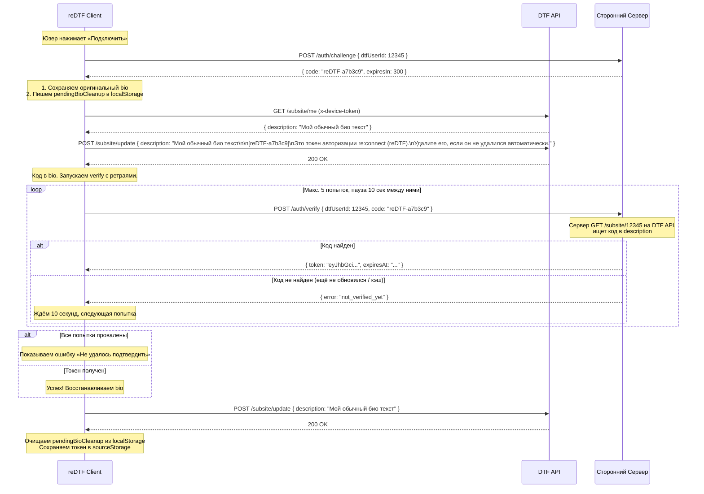
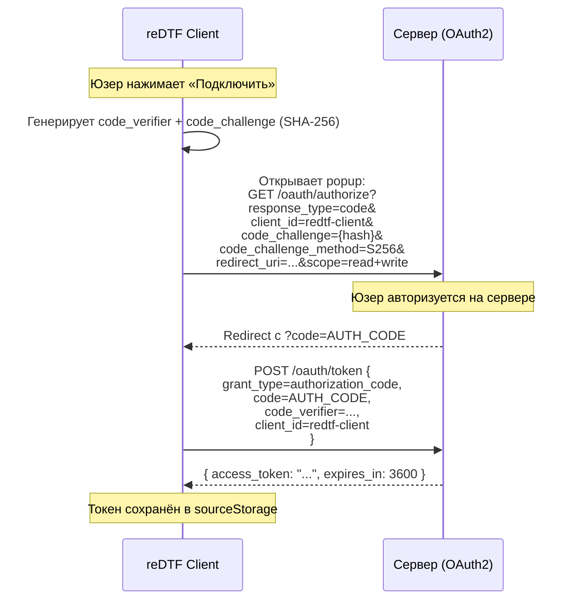

# Система Источников Данных (Data Sources) — Архитектурный проект v2

Полная перестройка текущей минимальной интеграции с кастомным сервером (`custom.ts` + хардкод в фасаде) в масштабируемую декларативную систему подключения произвольных источников данных.

---

## Текущее состояние

Сейчас: один хардкоженный `customApiProvider` с моками и `enableCustomApi` флаг в фасаде. Фасад ([index.svelte.ts](file:///run/media/donner/Samsung/Dev/ReProject/reDTF/src/lib/api/index.svelte.ts)) жёстко импортирует DTF и custom провайдеры, мёржит посты/комменты через `if (this.enableCustomApi)`. Всё одноразовое — нет ни манифестов, ни реестра, ни авторизации, ни пермиссий.

**Что нужно убрать:** [custom.ts](file:///run/media/donner/Samsung/Dev/ReProject/reDTF/src/lib/api/providers/custom.ts) — полностью. Весь хардкод `enableCustomApi` из фасада — тоже.

---

## Концепция

### Принципы

1. **Конфигурация, а не код.** Источник данных = JSON-манифест в Git-репозитории. Никакого исполняемого кода. Клиент **только** парсит конфигурацию и делает `fetch` по описанным эндпоинтам.
2. **Transparency first.** Все запросы из браузера (SPA), пользователь видит в DevTools каждый запрос. Основной DTF-токен **никогда** не передаётся сторонним серверам.
3. **Пермиссии только на запись.** Разрешения нужны только на действия, которые *отправляют или модифицируют* контент. Чтение с любого сервера свободное — юзер и так видит все эндпоинты в интерфейсе при добавлении источника.
4. **Вшитые + кастомные источники.** Несколько официальных репозиториев поставляются с клиентом. Пользователи могут добавлять свои по ссылке на Git-репозиторий.

---

## 1. Формат Манифеста

Репозиторий источника содержит `redtf-source.json` в корне.

### Структура репозитория

```
my-data-source/
├── redtf-source.json        # Главный манифест
├── CHANGELOG.md             # Лог изменений (показывается юзеру при обновлении)
├── README.md                # Описание для людей
└── deps/                    # Опционально: зависимости от других источников
    └── dep-manifest.json    # Ссылки на зависимые источники
```

### `redtf-source.json` — Полная спецификация

```jsonc
{
  // ─── Метаданные ───
  "manifestVersion": 1,
  "id": "dtf-deleted-comments",
  "name": "DTF Удалённые комментарии",
  "description": "Восстановление удалённых комментариев с DTF через архивный сервер",
  "version": "1.0.0",
  "author": {
    "name": "reDTF Team",
    "url": "https://github.com/re-dtf"
  },
  "icon": "https://example.com/icon.png",
  "homepage": "https://github.com/re-dtf/deleted-comments",
  "tags": ["dtf", "comments", "archive"],

  // ─── Подключение к API ───
  "api": {
    "baseUrl": "https://archive.redtf.org/api/v1",
    "defaultHeaders": {
      "X-Client": "reDTF",
      "X-Client-Version": "{{clientVersion}}"
    }
  },

  // ─── Авторизация ───
  "auth": {
    // "none"               — публичный API
    // "bio_verification"   — re:connect (подтверждение через DTF Bio)
    // "token_header"       — юзер вводит API-ключ вручную
    // "oauth2_pkce"        — OAuth2 Authorization Code + PKCE
    "type": "bio_verification",

    // Для bio_verification:
    "bioVerification": {
      "challengeEndpoint": "/auth/challenge",
      "challengeMethod": "POST",
      "verifyEndpoint": "/auth/verify",
      "verifyMethod": "POST",
      "tokenHeader": "Authorization",
      "tokenPrefix": "Bearer "
    },

    // Для token_header:
    "tokenHeader": {
      "headerName": "X-Api-Key",
      "inputLabel": "Введите API ключ сервера"
    },

    // Для oauth2_pkce:
    "oauth2": {
      "authorizationUrl": "https://my-server.com/oauth/authorize",
      "tokenUrl": "https://my-server.com/oauth/token",
      "clientId": "redtf-client",
      "scopes": ["read", "write"],
      "tokenHeader": "Authorization",
      "tokenPrefix": "Bearer "
    }
  },

  // ─── Разрешения (Permissions) ───
  // ТОЛЬКО на действия, которые отправляют/модифицируют контент.
  // Чтение — свободное, юзер видит все эндпоинты в интерфейсе.
  "permissions": [
    {
      "id": "mutate:comments:replace",
      "target": "dtf",
      "description": "Подмена удалённых комментариев для постов с DTF",
      "required": true
    },
    {
      "id": "mutate:comments:append",
      "target": "dtf",
      "description": "Добавление восстановленных комментариев в дерево DTF-поста",
      "required": false
    }
  ],

  // ─── Эндпоинты (Роутинг) ───
  // Каждый эндпоинт имеет human-readable `label` для отображения в UI
  "endpoints": {
    "getComments": {
      "label": "Получение комментариев поста",
      "description": "Загружает комментарии (в т.ч. удалённые) для указанного поста",
      "path": "/comments/{postId}",
      "method": "GET",
      "params": {
        "cursor": "{cursor}",
        "limit": "50"
      }
    },

    "getReplacedComments": {
      "label": "Получение подменённых комментариев",
      "description": "Возвращает комментарии, которые заменяют удалённые в DTF",
      "path": "/comments/{postId}/replaced",
      "method": "GET"
    },

    "getPosts": {
      "label": "Получение ленты постов",
      "description": "Загружает посты из источника для отображения в общей ленте",
      "path": "/posts",
      "method": "GET",
      "params": {
        "page": "{page}",
        "sorting": "{sorting}"
      }
    }
  },

  // ─── Зависимости от других источников ───
  "dependencies": [
    {
      "sourceId": "dtf-official",
      "reason": "Необходим для привязки комментариев к постам DTF"
    }
  ],

  // ─── Формат ответов ───
  // v1: сервер ОБЯЗАН возвращать данные в формате reDTF types.
  // responseMapping зарезервирован для будущего JSONPath маппинга (v2).
  "responseFormat": "redtf-native",

  // Заглушка для будущего маппинга. Клиент v1 игнорирует это поле,
  // но наличие его в спецификации позволит добавить маппинг без
  // ломающих изменений формата манифеста.
  "responseMapping": null
}
```

---

## 2. Система разрешений (Permissions)

Разрешения нужны **только** на действия, которые отправляют данные на сервер или визуально модифицируют контент другого источника в клиенте. Чтение данных с любого сервера — свободное, потому что:
- Юзер сам добавляет источник и видит все его эндпоинты в интерфейсе
- Эндпоинты имеют `label` и `description` — человеку понятно, что запрашивается
- Запросы уходят из браузера и видны в DevTools

### Каталог разрешений

| ID | Описание для юзера | Примечания |
|---|---|---|
| `write:comments` | Отправка комментариев на этот источник | Юзер пишет комментарий → он уходит на сервер |
| `write:comments:shadow` | Отправка комментариев на источник с отображением под постами `target` | Для забаненных юзеров: коммент виден только юзерам этого источника, но отображается под постом DTF |
| `write:posts` | Публикация постов на этот источник | Юзер создаёт пост → он уходит на сервер |
| `write:reactions` | Отправка реакций/лайков через этот источник | Своя система реакций |
| `mutate:comments:replace` | Подмена существующих комментариев для `target` | Пример: показ удалённых комментариев DTF. **Требует `target`** |
| `mutate:comments:append` | Виртуальное добавление комментариев в дерево постов `target` | «Теневые комменты»: видны юзерам этого источника в дереве другого сервера |
| `mutate:posts:enrich` | Обогащение постов `target` доп. данными (теги, рейтинги, аналитика) | Визуальные дополнения к постам другого источника |
| `auth:bio_write` | Временная запись проверочного кода в описание профиля DTF | Автоматически добавляется для `auth.type = "bio_verification"`. Явно показывает юзеру, что клиент будет редактировать его bio |

### Как это работает

```
Юзер добавляет источник по URL
        ↓
Клиент загружает redtf-source.json
        ↓
UI показывает две секции:

  📋 ЭНДПОИНТЫ (информационно):
  ┌─────────────────────────────────────────────┐
  │ GET  Получение комментариев поста           │
  │      Загружает комментарии для поста         │
  │ GET  Получение ленты постов                 │
  │      Загружает посты для общей ленты         │
  └─────────────────────────────────────────────┘

  ⚠️ РАЗРЕШЕНИЯ (подтверждение):
  ┌─────────────────────────────────────────────┐
  │ ☑ Подмена удалённых комментариев для DTF    │ ← required, нельзя снять
  │ ☐ Добавление комментариев в дерево DTF      │ ← опционально
  │ ⚠ Запись проверочного кода в bio DTF        │ ← auto для bio_verification
  └─────────────────────────────────────────────┘

        ↓
Юзер подтверждает → состояние сохраняется в localStorage
        ↓
При write/mutate запросах клиент проверяет grantedPermissions
```

> [!IMPORTANT]
> Пермиссии с `target` означают визуальную модификацию данных *другого* источника. В UI это выделяется предупреждением: «Этот источник будет изменять отображение данных с сервера *{target}*».

---

## 3. Авторизация

### 3.1 Типы авторизации

1. **`"none"`** — публичный API, авторизация не нужна.
2. **`"token_header"`** — юзер вводит API-ключ вручную в настройках. Для серверов, где регистрация на сайте сервера.
3. **`"bio_verification"`** — re:connect: подтверждение через запись кода в DTF Bio (подробно ниже).
4. **`"oauth2_pkce"`** — стандартный OAuth2 Authorization Code + PKCE. Сервер предоставляет страницу авторизации, клиент открывает в popup, получает код через redirect. Стандартнее, но требует от разработчика полноценной OAuth2 реализации.

### 3.2 Bio Verification (re:connect) — подробный флоу



#### Конфигурируемые параметры (в коде клиента)

```typescript
// src/lib/api/sources/bio-auth.ts
const BIO_VERIFY_MAX_ATTEMPTS = 5;       // Макс. попыток verify
const BIO_VERIFY_RETRY_DELAY_MS = 10000; // Пауза между попытками (10 сек)
const BIO_CLEANUP_TTL_MS = 10 * 60000;   // Макс. время жизни кода в bio (10 мин)
```

#### Текст в bio

Код записывается с пояснительным текстом, чтобы если cleanup не сработает, юзер мог удалить вручную:

```
[reDTF-a7b3c9]
Это токен авторизации re:connect (reDTF).
Удалите его, если он не удалился автоматически.
```

Клиент при cleanup убирает **весь этот блок** целиком (код + текст), восстанавливая оригинальный bio.

#### Защита от прерывания (Bio Cleanup)

Перед записью кода в bio клиент сохраняет в localStorage:
```json
{
  "originalBio": "Мой обычный био текст",
  "sourceId": "dtf-deleted-comments",
  "code": "reDTF-a7b3c9",
  "timestamp": 1721234567890
}
```

При следующем запуске клиент проверяет этот флаг:
- Если есть `pendingBioCleanup` → восстанавливает оригинальный bio
- Если прошло > `BIO_CLEANUP_TTL_MS` → считаем верификацию провалившейся, просто чистим

#### Безопасность Bio Verification

- Код привязан к конкретному `dtfUserId` на стороне сервера
- TTL кода — 5 минут (сервер отвечает в `expiresIn`)
- Код одноразовый — после успешной верификации больше не принимается
- **Рекомендация для разработчиков серверов**: Rate-limiting на `/auth/challenge` — не более 3 запросов в минуту на один `dtfUserId`. Это предотвращает спам-генерацию кодов.

### 3.3 OAuth2 PKCE — флоу



---

## 4. Маршрутизация ID

Текущая стратегия `id >= 1000` — хардкод. Заменяем **составными ID**.

### Стратегия: `sourceId:originalId`

Каждый `Post` и `Comment` получает поле `sourceId: string`. Внутри клиента это определяет, к какому источнику относится объект:

```typescript
// types.ts — изменения
interface Post {
  id: number;
  sourceId: string;           // 'dtf', 'my-archive', etc.
  title: string;
  // ...
}

interface Comment {
  id: number;
  sourceId: string;           // 'dtf', 'my-archive', etc.
  postId: number;
  // ...
}
```

**Правила маршрутизации:**

| Операция | Как определяется источник |
|---|---|
| `getPosts()` | Фасад собирает со всех активных источников, каждый пост размечается `sourceId` |
| `getPost(id)` | В UI при открытии поста передаётся `sourceId` вместе с `id` |
| `getComments(postId)` | Собирает из основного источника поста + из всех с `mutate:comments:*` для этого target |
| `reactToComment(commentId)` | Роутится по `comment.sourceId` |
| `write:comments` | Юзер выбирает, на какой сервер пишет (если несколько поддерживают запись) |

**DTF остаётся `sourceId: "dtf"` — хардкоженный первичный источник,** всегда активный.

---

## 5. Архитектура клиента

### Обзор модулей

```
src/lib/
├── api/
│   ├── index.svelte.ts              # [MODIFY] Фасад → мультипровайдерный роутинг
│   ├── types.ts                     # [MODIFY] + sourceId в Post/Comment
│   ├── utils.ts                     # Без изменений
│   ├── providers/
│   │   ├── dtf.ts                   # [MODIFY] добавляет sourceId: 'dtf' к результатам
│   │   └── custom.ts               # [DELETE]
│   └── sources/                     # [NEW] Система источников
│       ├── types.ts                 # Типы манифеста, пермиссий, состояния
│       ├── registry.svelte.ts       # Реестр всех источников
│       ├── manifest-loader.ts       # Загрузка/валидация манифестов
│       ├── source-fetcher.ts        # Универсальный fetch для источников
│       ├── permissions.ts           # Проверка пермиссий
│       ├── merger.ts                # Объединение данных от нескольких источников
│       ├── bio-auth.ts              # Bio Verification флоу
│       ├── oauth-auth.ts            # OAuth2 PKCE флоу
│       └── builtins.ts             # Вшитые источники
├── storage/
│   ├── auth.svelte.ts               # Без изменений
│   ├── persisted.svelte.ts          # Без изменений
│   └── sources.svelte.ts            # [NEW] Хранение источников + токенов + пермиссий
```

### 5.1 Типы (`src/lib/api/sources/types.ts`)

```typescript
/** Тип авторизации источника */
type SourceAuthType = 'none' | 'bio_verification' | 'token_header' | 'oauth2_pkce';

/** Манифест источника данных */
interface SourceManifest {
  manifestVersion: number;
  id: string;
  name: string;
  description: string;
  version: string;
  author: { name: string; url?: string };
  icon?: string;
  homepage?: string;
  tags?: string[];

  api: {
    baseUrl: string;
    defaultHeaders?: Record<string, string>;
  };

  auth: {
    type: SourceAuthType;
    bioVerification?: {
      challengeEndpoint: string;
      challengeMethod: 'GET' | 'POST';
      verifyEndpoint: string;
      verifyMethod: 'GET' | 'POST';
      tokenHeader: string;
      tokenPrefix?: string;
    };
    tokenHeader?: {
      headerName: string;
      inputLabel: string;
    };
    oauth2?: {
      authorizationUrl: string;
      tokenUrl: string;
      clientId: string;
      scopes: string[];
      tokenHeader: string;
      tokenPrefix?: string;
    };
  };

  permissions: SourcePermission[];
  endpoints: Record<string, SourceEndpoint>;
  dependencies?: SourceDependency[];

  responseFormat: 'redtf-native';
  responseMapping: null;       // Зарезервировано для v2 JSONPath маппинга
}

/** Разрешение — ТОЛЬКО на write/mutate операции */
interface SourcePermission {
  id: string;                     // 'write:comments', 'mutate:comments:replace', etc.
  target?: string;                // ID целевого источника (для mutate)
  description: string;            // Human-readable для UI
  required?: boolean;             // Нельзя отключить
}

/** Эндпоинт с human-readable описанием */
interface SourceEndpoint {
  label: string;                  // «Получение комментариев поста»
  description: string;            // «Загружает комментарии для указанного поста»
  path: string;                   // '/comments/{postId}'
  method: 'GET' | 'POST' | 'PUT' | 'DELETE';
  params?: Record<string, string>;
}

/** Зависимость от другого источника */
interface SourceDependency {
  sourceId: string;
  reason: string;
}

/** Состояние подключённого источника (localStorage) */
interface SourceState {
  manifestUrl: string;
  manifest: SourceManifest;
  enabled: boolean;
  grantedPermissions: string[];
  authToken?: string;
  authTokenExpiresAt?: number;
  addedAt: number;
  lastUpdated: number;
  isBuiltin: boolean;
}

/** Pending bio cleanup (localStorage) */
interface PendingBioCleanup {
  originalBio: string;
  sourceId: string;
  code: string;
  timestamp: number;
}
```

### 5.2 Реестр (`src/lib/api/sources/registry.svelte.ts`)

```typescript
let sources = $state<SourceState[]>(loadFromStorage());

export const sourceRegistry = {
  get activeSources() { return sources.filter(s => s.enabled); },

  // Получить источники, у которых ЕСТЬ определённая подтверждённая пермиссия
  getSourcesWithPermission(permissionId: string, target?: string): SourceState[],

  // Добавить → загрузить манифест → показать ревью → сохранить
  async addSource(manifestUrl: string): Promise<SourceManifest>,

  // Удалить (кастомные), отключить (builtin)
  removeSource(sourceId: string): void,

  // Ручное обновление манифеста. Возвращает diff пермиссий/эндпоинтов
  // и changelog (если есть) для ревью юзером
  async refreshManifest(sourceId: string): Promise<ManifestUpdateResult>,

  toggleSource(sourceId: string, enabled: boolean): void,
  updatePermissions(sourceId: string, grantedPermissions: string[]): void,
  async authenticate(sourceId: string): Promise<void>,
  revokeAuth(sourceId: string): void,
};

interface ManifestUpdateResult {
  newVersion: string;
  oldVersion: string;
  addedPermissions: SourcePermission[];
  removedPermissions: SourcePermission[];
  addedEndpoints: Record<string, SourceEndpoint>;
  removedEndpoints: string[];
  modifiedEndpoints: Record<string, { old: SourceEndpoint; new: SourceEndpoint }>;
  changelog: string | null;        // Содержимое CHANGELOG.md (если есть)
  requiresReapproval: boolean;     // true если добавлены новые пермиссии
}
```

### 5.3 Загрузчик манифестов (`manifest-loader.ts`)

```typescript
/**
 * Загружает манифест из URL.
 * Поддерживаемые форматы:
 * - Прямая ссылка: https://example.com/redtf-source.json
 * - GitHub raw: https://raw.githubusercontent.com/user/repo/main/redtf-source.json
 * - Сокращённый: github:user/repo → авто-резолв в raw URL
 */
async function loadManifest(url: string): Promise<SourceManifest>
function validateManifest(data: unknown): data is SourceManifest
function resolveGitHubUrl(shortUrl: string): string

/**
 * Загружает CHANGELOG.md из того же репозитория (рядом с манифестом).
 * Возвращает null если файл не найден.
 */
async function loadChangelog(manifestUrl: string): Promise<string | null>
```

### 5.4 Source Fetcher (`source-fetcher.ts`)

```typescript
/**
 * Выполняет запрос к эндпоинту источника.
 * - Подставляет auth заголовок (если есть)
 * - Резолвит шаблоны в path: {postId} → 12345
 * - Добавляет defaultHeaders из манифеста
 * - НЕ проверяет пермиссии (это делает фасад/registry для write-операций)
 *
 * Подготовлен для будущего responseMapping:
 * если manifest.responseMapping !== null, здесь будет вызываться
 * трансформация ответа. Сейчас просто возвращает response.json().
 */
async function fetchFromSource<T>(
  source: SourceState,
  endpointKey: string,
  pathParams?: Record<string, string | number>,
  queryOverrides?: Record<string, string>
): Promise<T>
```

### 5.5 Permissions (`permissions.ts`)

```typescript
/**
 * Проверяет, есть ли у источника подтверждённая пермиссия.
 * Вызывается фасадом ПЕРЕД write/mutate операциями.
 */
function hasPermission(source: SourceState, permissionId: string, target?: string): boolean

/**
 * Сравнивает пермиссии старого и нового манифеста.
 * Используется при обновлении для определения, нужно ли переподтверждение.
 */
function diffPermissions(oldManifest: SourceManifest, newManifest: SourceManifest): PermissionsDiff
```

### 5.6 Merger (`merger.ts`)

```typescript
/** Объединить посты из нескольких источников, сортировка по дате */
function mergePosts(results: { sourceId: string; posts: Post[] }[]): Post[]

/**
 * Объединить комментарии с поддержкой append и replace.
 *
 * Подготовлен для responseMapping: принимает уже трансформированные
 * Comment[], не занимается парсингом сырых ответов.
 */
function mergeComments(
  primary: Comment[],
  additions: { sourceId: string; comments: Comment[]; mode: 'append' | 'replace' }[]
): Comment[]
```

### 5.7 Переделка фасада (`index.svelte.ts`)

```typescript
import { dtfApiProvider } from './providers/dtf';
import { sourceRegistry } from './sources/registry.svelte';
import { fetchFromSource } from './sources/source-fetcher';
import { mergePosts, mergeComments } from './sources/merger';
import { hasPermission } from './sources/permissions';

export const api = {
  async getPosts(options?: GetPostsOptions) {
    // 1. DTF (всегда)
    const dtfResult = await dtfApiProvider.getPosts(options);

    // 2. Все активные источники, у которых есть endpoint 'getPosts'
    const extraSources = sourceRegistry.activeSources
      .filter(s => s.manifest.endpoints['getPosts']);

    const extras = await Promise.allSettled(
      extraSources.map(s =>
        fetchFromSource<PaginatedResult<Post>>(s, 'getPosts', {}, { /* ... */ })
      )
    );

    // 3. Мёрж — каждый пост уже имеет sourceId
    return mergePosts([
      { sourceId: 'dtf', posts: dtfResult.items },
      ...extras
        .filter(r => r.status === 'fulfilled')
        .map((r, i) => ({
          sourceId: extraSources[i].manifest.id,
          posts: r.value.items
        }))
    ]);
  },

  async getComments(postId: number, sourceId: string, cursor?, sorting?) {
    // sourceId определяет, откуда пост. Комментарии берём оттуда.
    // Плюс все источники с mutate:comments:append/replace для этого target.
    // ...
  },

  async reactToComment(commentId: number, reactionId: number, sourceId: string) {
    // Роутим по sourceId
    if (sourceId === 'dtf') {
      return dtfApiProvider.reactToComment?.(commentId, reactionId);
    }
    const source = sourceRegistry.activeSources.find(s => s.manifest.id === sourceId);
    if (source && hasPermission(source, 'write:reactions')) {
      return fetchFromSource(source, 'reactToComment', { commentId }, { reactionId: String(reactionId) });
    }
  },

  // Editor-методы — по-прежнему только DTF
  async saveDraft(entry) { /* dtf only */ },
  async uploadMedia(file) { /* dtf only */ },
  // ...
};
```

### 5.8 Хранилище (`src/lib/storage/sources.svelte.ts`)

```typescript
const sourcesState = persistedState<SourceState[]>('redtf:sources', []);
const pendingBioCleanup = persistedState<PendingBioCleanup | null>('redtf:bio-cleanup', null);

export const sourceStorage = {
  get sources() { return sourcesState.value; },
  set sources(v) { sourcesState.value = v; },

  getToken(sourceId: string): string | undefined,
  setToken(sourceId: string, token: string, expiresAt?: number): void,

  get pendingBioCleanup() { return pendingBioCleanup.value; },
  set pendingBioCleanup(v) { pendingBioCleanup.value = v; },
};
```

---

## 6. Магазин Источников (Source Catalog)

Отдельный репозиторий в организации (например `github:re-dtf/source-catalog`) с файлом `catalog.json`:

```jsonc
{
  "catalogVersion": 1,
  "lastUpdated": "2026-07-17",
  "sources": [
    {
      "id": "dtf-deleted-comments",
      "name": "DTF Удалённые комментарии",
      "description": "Восстановление удалённых комментариев",
      "author": "reDTF Team",
      "manifestUrl": "github:re-dtf/source-deleted-comments",
      "icon": "https://...",
      "tags": ["dtf", "comments", "archive"],
      "verified": true              // Проверенный командой reDTF
    },
    {
      "id": "community-reactions",
      "name": "Расширенные реакции",
      "description": "Альтернативная система реакций от сообщества",
      "author": "CommunityDev",
      "manifestUrl": "github:community-dev/redtf-reactions",
      "tags": ["reactions", "community"],
      "verified": false
    }
  ]
}
```

### В клиенте:
- Кнопка «Каталог» в настройках источников
- Загружает `catalog.json` по кнопке
- Показывает список с описаниями, отметкой verified/unverified
- Установка одним нажатием → загрузка манифеста → ревью пермиссий → готово

---

## 7. Вшитые источники (Builtins)

```typescript
// src/lib/api/sources/builtins.ts
export const BUILTIN_SOURCES: string[] = [
  'github:re-dtf/source-deleted-comments',
  'github:re-dtf/source-extended-feed',
];
```

При первом запуске клиент проверяет, установлены ли все builtins, и предлагает добавить. Вшитые: `isBuiltin: true`, нельзя удалить (только отключить).

---

## 8. Обновление манифестов

**Только ручное** — кнопка «Обновить» на карточке источника.

При обновлении клиент:
1. Загружает свежий `redtf-source.json` по `manifestUrl`
2. Загружает `CHANGELOG.md` из того же репо (если есть)
3. Вычисляет diff:
   - Новые пермиссии → ⚠️ **требуют подтверждения** (источник отключается до подтверждения)
   - Удалённые пермиссии → автоматически убираются из `grantedPermissions`
   - Новые/изменённые эндпоинты → информационно показываются
4. Показывает юзеру экран «Обновление источника» с:
   - Версия: `1.0.0 → 1.1.0`
   - Changelog (если есть)
   - Diff пермиссий и эндпоинтов
   - Кнопка «Подтвердить обновление»

---

## 9. UI: Управление источниками

Новая секция в overlay настроек: **«Источники данных»**.

### Экраны:

1. **Список источников** — карточки: имя, описание, статус (вкл/выкл), авторизован ли, кнопки «Настроить» / «Обновить» / «Удалить».
2. **Добавление источника** — поле ввода URL + «Добавить». Показ загруженного манифеста: эндпоинты (с `label`/`description`) и пермиссии для ревью.
3. **Каталог** — загрузка `catalog.json`, список доступных источников с установкой в один клик.
4. **Детали источника** — полная информация: эндпоинты, пермиссии (с тогглами), зависимости, кнопка авторизации.
5. **Подтверждение пермиссий** — модалка: write/mutate пермиссии с чекбоксами. Опасные (`mutate:*` с `target`) выделены предупреждением.
6. **Bio Verification** — пошаговый UI: «Генерируем код → Записываем в профиль → Проверяем (попытка 1/5) → Готово» с прогресс-баром.
7. **Обновление источника** — экран diff'а: версии, changelog, новые пермиссии/эндпоинты.

---

## Proposed Changes

### Новая подсистема: Sources

#### [NEW] `src/lib/api/sources/types.ts`
Все типы: манифест, пермиссии, эндпоинты (с `label`/`description`), состояние, bio cleanup, catalog.

#### [NEW] `src/lib/api/sources/registry.svelte.ts`
Реестр: реактивный список, добавление/удаление/обновление с diff'ом, каталог.

#### [NEW] `src/lib/api/sources/manifest-loader.ts`
Загрузка/валидация манифестов из URL/`github:` shorthand. Загрузка CHANGELOG.md.

#### [NEW] `src/lib/api/sources/source-fetcher.ts`
Универсальный fetch. Подготовлен для будущего `responseMapping`.

#### [NEW] `src/lib/api/sources/permissions.ts`
Проверка write/mutate пермиссий. Diff для обновлений.

#### [NEW] `src/lib/api/sources/merger.ts`
Объединение данных: mergePosts, mergeComments (append/replace).

#### [NEW] `src/lib/api/sources/bio-auth.ts`
Bio Verification: challenge → inject → verify (5 попыток / 10 сек) → cleanup. Конфигурируемые лимиты.

#### [NEW] `src/lib/api/sources/oauth-auth.ts`
OAuth2 PKCE: code_verifier/challenge генерация, popup, token exchange.

#### [NEW] `src/lib/api/sources/builtins.ts`
Массив URL вшитых источников.

---

### Хранилище

#### [NEW] `src/lib/storage/sources.svelte.ts`
Источники, токены, пермиссии, pendingBioCleanup.

---

### Модификация существующих файлов

#### [MODIFY] [index.svelte.ts](file:///run/media/donner/Samsung/Dev/ReProject/reDTF/src/lib/api/index.svelte.ts)
Убрать хардкод custom provider. Мультипровайдерный роутинг через registry. `sourceId` в аргументах write-методов.

#### [MODIFY] [types.ts](file:///run/media/donner/Samsung/Dev/ReProject/reDTF/src/lib/api/types.ts)
Добавить `sourceId: string` в `Post` и `Comment`.

#### [MODIFY] [dtf.ts](file:///run/media/donner/Samsung/Dev/ReProject/reDTF/src/lib/api/providers/dtf.ts)
Добавить `sourceId: 'dtf'` в `mapEntryToPost()` и маппинг комментариев.

#### [DELETE] [custom.ts](file:///run/media/donner/Samsung/Dev/ReProject/reDTF/src/lib/api/providers/custom.ts)
Заменяется полностью новой системой.

---

### UI компоненты (будущая фаза)

#### [NEW] `src/lib/components/sources/SourcesSettings.svelte`
Основной UI управления источниками.

#### [NEW] `src/lib/components/sources/SourceCard.svelte`
Карточка одного источника.

#### [NEW] `src/lib/components/sources/SourcePermissions.svelte`
Модалка подтверждения write/mutate пермиссий.

#### [NEW] `src/lib/components/sources/BioVerification.svelte`
Пошаговый UI авторизации через bio с прогрессом.

#### [NEW] `src/lib/components/sources/SourceCatalog.svelte`
Магазин/каталог источников.

#### [NEW] `src/lib/components/sources/SourceUpdate.svelte`
Экран обновления с diff'ом и changelog'ом.

---

## Verification Plan

### Automated Tests
```bash
npx vitest run src/lib/api/sources/permissions.test.ts
npx vitest run src/lib/api/sources/merger.test.ts
npx vitest run src/lib/api/sources/manifest-loader.test.ts
```

### Manual Verification
1. Добавить mock-источник по URL → проверить парсинг манифеста, отображение эндпоинтов и пермиссий.
2. Проверить мёрж постов/комментариев с mock-источником.
3. Проверить bio verification флоу (retry, cleanup, ошибки).
4. Проверить OAuth2 PKCE флоу через popup.
5. Проверить ручное обновление манифеста: diff пермиссий, changelog.
6. Проверить каталог: загрузка, установка, verified-метка.
7. Проверить Bio cleanup при перезагрузке страницы.
8. Проверить что `sourceId` корректно проставляется и роутинг работает.
